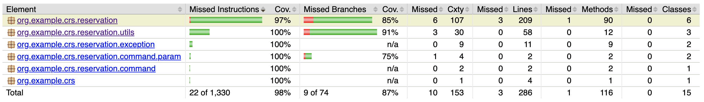

# Campsite Reservation Service

Before anything, please forgive my english! (I'm trying to improve it :p)

## Purpose

As described in the **Upgrade Backend Coding Challenge** document, this service purpose is to offer endpoints to manage campsite reservations.

## About how and why... 

First thing first, I'm a fullstack developer. It means that I spend half of my time between backend and frontend sides. But, also as a backend developer, I've more experiences using NodeJS than Java (these last years). So, even if I'm used to work with Java, I did not create a full Java (web) project from scratch since a few years (and for that, thank you!).

To create this service, I chose to use the Akka libraries set. I did this because I was very interested by this librairies set, but did not have the opportunity to test it yet. So, as long as I spent a few hours on this test, I told myself that I could take the opportunity to learn new things.

About the usage of asynchronous & concurrent APIs in this project, I have to say that I don't know them a lot. In my current job, we are using a custom Future implementation library... Also, as I said, in my last jobs, I was not using Java, but NodeJS, so I missed the moment where they release all the new stuff about Streams, Futures, Functional Interfaces etc... I tried to use them correctly :)

Akka is mostly used with the Scala language, but few hours are not enough to learn and code with new libraries AND a new language (even if I did test Scala a little bit the last year). So I decided to go with Java. This decision was not without repercutions, because most of the (good) examples/code-snippets on "how to deal with Akka" are in Scala.

At the beginning of the project, I wanted to use a relational database (in a cluster mode). I was afraid to spend a lot of time with Docker and Docker-compose and then miss time for the requirements. So I decided to move forward first and build something that works, then if I have time, try to improve it. But I did not have enough time... So, as it is now, the service uses a in-memory repository. Obviously, I can't scale the service horizontally. Even in these circonstances, the repository interface returns only asynchronous responses. So adding, for example, a Redis implementation of the repository, could be a first step to make the service scalable inside some docker containers orchestrated by Kubernetes.

Please check the improvements section for more details on what I would do with more time.

## About the dates

The requirements specify that every arrival/departure is fixed to 12:00 am, so I decided to format dates using the simple `yyyy-MM-dd` format.

So a camper can arrive the same day when the previous one is leaving and each day is implicitly set to 12:00 am (e.g. `2020-08-01` <=> `2020-08-01 12:00:00`).

## How to run the service

The project is running with **Maven 3.6.3** and **Java 11.0.1**.

You simply need to do:

```
$ git clone git@github.com:bcolucci/crs.git
$ cd crs/
$ mvn compile exec:java
[...]
2020-07-29 20:44:51:180 [CRS-akka.actor.default-dispatcher-3] INFO Slf4jLogger started
2020-07-29 20:44:52:028 [ForkJoinPool.commonPool-worker-3] INFO Server online at http://127.0.0.1:8080/
```

## Endpoints

**I'm very sorry to not have been able to use Swagger!** But I had some troubles trying to setup it with the version of Akka Http I'm using... Seems there are some issues currently with the Swagger maven plugin.

## Summary

Method | URL | Description
-------|-----|------------
GET | /reservations | Get availabilities
POST | /reservations | Create a reservation
PUT | /reservations/**{id}** | Update a reservation
DELETE | /reservations/**{id}** | Cancel a reservation

---

### Create a reservation

    POST /reservations

```json
{
    "clientEmail": "brice.colucci@gmail.com",
    "clientName": "Brice Colucci",
    "arrivalDate": "2020-08-03",
    "departureDate": "2020-08-05"
}
```

```json
{
    "statusCode": 201,
    "reservation": {
        "id": "50c5c5e9-366c-4f08-b8fb-1abba0332da0",
        "clientEmail": "brice.colucci@gmail.com",
        "clientName": "Brice Colucci",
        "arrivalDate": "2020-08-03",
        "departureDate": "2020-08-05",
        "status": "ACTIVE"
    }
}
```

---

### Update a reservation

    PUT /reservations/{id}

```json
{
	"arrivalDate": "2020-08-05",
	"departureDate": "2020-08-07"
}
```

```json
{
    "statusCode": 200,
    "reservation": {
        "id": "50c5c5e9-366c-4f08-b8fb-1abba0332da0",
        "clientEmail": "brice.colucci@gmail.com",
        "clientName": "Brice Colucci",
        "arrivalDate": "2020-08-05",
        "departureDate": "2020-08-07",
        "status": "ACTIVE"
    },
}
```

---

### Get a reservation

    GET /reservations/{id}

```json
{
    "statusCode": 200,
    "reservation": {
        "id": "50c5c5e9-366c-4f08-b8fb-1abba0332da0",
        "clientEmail": "brice.colucci@gmail.com",
        "clientName": "Brice Colucci",
        "arrivalDate": "2020-08-05",
        "departureDate": "2020-08-07",
        "status": "ACTIVE"
    },
}
```

---

## Cancel a reservation

It will put the status as `CANCELED`, so the period will be available again.

    DELETE /reservations/{id}

```json
{
    "statusCode": 200,
    "reservation": {
        "id": "50c5c5e9-366c-4f08-b8fb-1abba0332da0",
        "clientEmail": "brice.colucci@gmail.com",
        "clientName": "Brice Colucci",
        "arrivalDate": "2020-08-05",
        "departureDate": "2020-08-07",
        "status": "CANCELED"
    },
}
```

---

## Check availabilities

Let's create first 3 reservations:

* From the 2020-08-**03** to the 2020-08-**04** ;
* From the 2020-08-**06** to the 2020-08-**08** ;
* And from the 2020-08-**08** to the 2020-08-**10**

```
$ curl -XPOST --data '{"clientEmail":"john.doe@gmail.com","clientName":"John Doe","arrivalDate":"2020-08-03","departureDate":"2020-08-04"}' http://localhost:8080/reservations

$ curl -XPOST --data '{"clientEmail":"john.doe@gmail.com","clientName":"John Doe","arrivalDate":"2020-08-06","departureDate":"2020-08-08"}' http://localhost:8080/reservations

$ curl -XPOST --data '{"clientEmail":"john.doe@gmail.com","clientName":"John Doe","arrivalDate":"2020-08-08","departureDate":"2020-08-10"}' http://localhost:8080/reservations
```

Then, let's check availabilities:

    GET /reservations

```json
{
    "statusCode": 200,
    "from": "2020-07-30",
    "to": "2020-08-30",
    "availabilities": [
        {
            "from": "2020-07-30",
            "to": "2020-08-03",
            "nbDays": 4
        },
        {
            "from": "2020-08-04",
            "to": "2020-08-06",
            "nbDays": 2
        },
        {
            "from": "2020-08-10",
            "to": "2020-08-30",
            "nbDays": 20
        }
    ]
}
```

I ran this call the 29th of July. So as you can see, if I don't specify a `from` and/or a `to` query parameter, by default:

* from = current day + 1
* to = from + 1 month

Let's specify a period:

    GET /reservations?from=2020-08-05&to=2020-08-15

```json
{
    "statusCode": 200,
    "from": "2020-08-05",
    "to": "2020-08-15",
    "availabilities": [
        {
            "from": "2020-08-05",
            "to": "2020-08-06",
            "nbDays": 1
        },
        {
            "from": "2020-08-10",
            "to": "2020-08-15",
            "nbDays": 5
        }
    ]
}
```

## Error handling

Any error is returned in a JSON format. A status code will always be present, but the message is optional (like for a `NOT_FOUND` for example).

Please check some examples:

---

    GET /reservations/123-456

```json
{
    "statusCode": 500,
    "error": "Invalid UUID string: 123-456",
}
```

---

    GET /reservations/b2ae1aab-57a4-42d4-99e8-6ae9408d8581

```json
{
    "statusCode": 404
}
```

---

    POST /reservations

```json
{
    "clientEmail": "brice.colucci@gmail.com",
    "clientName": "Brice Colucci",
    "arrivalDate": "2020-08-03",
    "departureDate": "2020-08-09"
}
```

```json
{
    "statusCode": 400,
    "error": "You can not reserve for more than three days."
}
```

## Documentation

The project is configurated so you can generate the JavaDoc (`mvn site`).

I know I could do better with the code documentation, but I still have something correct considering that the tests help a lot...

## Tests

I used the Akka **testkit** to test the routes (integration tests). I also wrote some unit tests.



```
Results :

Tests run: 46, Failures: 0, Errors: 0, Skipped: 0
```

## Load test

The requirements specify that the service must be able to receive a lot of (concurrent) requests.

As I said before, the service can't be scaled horizontally yet. But using Akka and asynchronous operations, a single instance is currently able to support a lot of concurrent requests.

I first wanted to use a stress test library, but I did not want to spend too much time on that (because I know NodeJS stress tests librairies, but not familiar enough with the Java ones). So I decided to write a `LoadTest.java` file which makes native `java.net` HTTP requests.

**Please consider that I was watching some great shows on Netflix on Chrome... during the load test.. It may impacted my machine performance :D**

The script is performing different actions:
* It creates reservations ;
* It retrieves reservations (by id) ; 
* It updates reservations ;
* It cancels reservations ;
* It asks for availabilities ;

All of these different operations are running concurrently, and every task is running a batch of concurrent requests. Also, every update request is making a retrieve request at first. 

For example, I ran a test that, during **5 minutes** concurrently requests for:
* 15 creations / 50ms (e.q. to 300 rps)
* 20 retrievals / 500ms (e.q. to 40 rps)
* (15 updates + 15 retrievals) / 50ms (e.q. to 600 rps)
* 15 cancelations / 50 ms (e.q. to 300 rps)
* and 15 check availabilities / 50ms (e.q. to 300 rps)

As you can see bellow, even if the report (and the test) are far from being optimal, my single instance is able to process about **1,300 rps** on my machine, without any exception that could kill the service.

By the way, the test also simulates some `NOT_FOUND` and `BAD_REQUEST` calls.

```
CREATE avg time = 1.1509117710005687ms
RETRIEVE avg time = 0.5173205109252134ms
UPDATE avg time = 0.8234418310669223ms
CANCEL avg time = 0.5762707944002022ms
AVAILABILITIES avg time = 1.23775162357924ms
number of requests = 394252
execution time = 300580ms
requests per second = 1314.0
```

Of course, if I run the script much longer, for example **one hour**, the performance will be affected. But it's not realistic, for this service, to be asked (as much as the script does) to create, update, retrieve, cancel reservations and return availabilities at this rate without any break. I mean, it's a campsite reservation service, people do not constantly reserve and cancel their reservation! Even so, my single instance continues to handle nearly **400 rps**:

```
CREATE avg time = 1.6474032087801391ms
RETRIEVE avg time = 0.7346280031051051ms
UPDATE avg time = 1.5233774888673572ms
CANCEL avg time = 0.7677730798100975ms
AVAILABILITIES avg time = 1.8750405221087743ms
number of requests = 1464261
execution time = 3600619ms
requests per second = 406.0
```

## Improvements

If I would have (a little) more time:

* I would add the missing `clientEmail` and `clientName` validation. Currently, only period and status are checked.
* I would create a Redis implementation of the repository and test the performances with a local cluster and multiple service instances.
* I would try to find a solution to integrate Swagger.
* I would improve how Exceptions are designed.
* I would improve the Documentation.
* I would Dockerize the application.
* I would deploy the app on AWS.
* I would integrate a real Stress test tool.
* I would take more time to read Akka documentation.
* I would learn Scala for good.
* [...]

## About the time spent

I think that I spent approximatly twenty hours on this project. I lost time obviously on things I did not know very well, like all the Akka stuff, but it worth it!

Also, I had some weird issues with Maven configuration or when I wanted to add Swagger on Akka Http... I'm not used too with `npm`, or at least it's simpler to resolve!

## Thanks

Every technical test is an opportunity for me (when I have time). For example, for LogMeIn, I did this one: https://github.com/bcolucci/cards. In this one, I had three objectives : no lib for the core, make it very small, use functional programming as much as I can do with JavaScript.

I really want to thank you guys for this technical test. It was very fun, and I learned new things. It would be easier to use something I more used to, like Spring Boot but less fun (honestly, I started with this, then I switch to Akka after one or two hours of work ^^).
